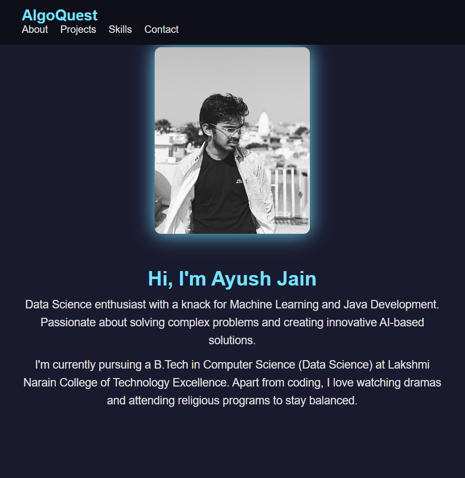

# 🚀 AlgoQuest Portfolio

### 🌐 A Way to Code Your Success

This is my personal portfolio website — AlgoQuest — where I showcase my projects, skills, and experience in Data Science and AI.

---

### 🖥️ Live Demo

👉 [Visit My Portfolio ](https://ayushjainsparsh-algoquest.onrender.com/)

---

### 📁 Project Structure

├── index.html 
├── style.css 
├── script.js 
└── assets/ 
    ├── images/ 
    └── fonts/

---

### 🎯 Features

✅ Clean and responsive design
✅ Interactive transitions and animations
✅ Professional profile section
✅ Showcase of top projects
✅ Linktree integration for other projects

---

### 🛠️ Tech Stack

- HTML5
- CSS3
- JavaScript

---

### 📸 Preview

---

### 🤝 Connect with Me

- 💼  [LinkedIn](https://linkedin.com/in/ayushjainsparsh)

---

# 👨‍💻 Built with ❤️ by Ayush Jain
